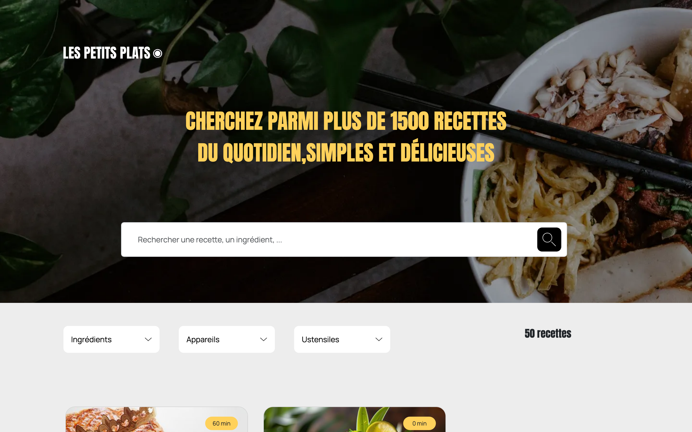

# OpenClassrooms – Project 7 Les petits plats

## 📌 Description

Source code of **Project 7 – Les petits plats**: _Develop a search algorithm with JavaScript_, completed as part of the **OpenClassrooms JavaScript React Developer path**.

This project simulates the development of a **recipe search platform**, 
where the main challenge is to design and implement an **efficient search 
engine** in **vanilla JavaScript**, by designing a scalable search engine where performance and responsiveness directly impact user experience.

The work involved:
- Building a responsive **user interface** with **Bootstrap**, focusing on usability and clarity of recipe search.
- Implementing **two different search algorithms** capable of filtering large JSON datasets.
- Benchmarking and comparing algorithm performance using tools like **Jsben.ch**, to determine the most efficient solution.
- Applying **Green Code principles**, ensuring that the chosen solution is not only performant but also mindful of environmental impact.

This project provided a strong introduction to **algorithm analysis and optimization**, essential skills for handling large datasets in real-world applications.

⚠️ **Educational project**: This repository was created for learning purposes during my training. It is **not intended for production use**.

---

## 🎯 Learning Objectives

- Analyse a **computational problem** and break it down into solvable parts
- Design and implement a **search algorithm** in JavaScript
- Analyse and optimize algorithm performance with a focus on scalability
- Compare and **benchmark algorithm performance** using tools such as Jsben.ch
- Apply **data structures** and methods to efficiently process and filter large datasets
- Build a **responsive and user-friendly UI** with Bootstrap (in the project's requirements)
- Apply **Green Code principles** by considering performance and environmental impact

## 🔗 Provided Resources

- [50 recipes data in JSON format](https://github.com/OpenClassrooms-Student-Center/PetitsPlats2.0)
- [Pictures assets](https://course.oc-static.com/projects/D%C3%A9veloppeur+Web/JS/P7/JSON+recipes.zip)
- [Research use case description](https://course.oc-static.com/projects/516_JS/P7/Cas+d%E2%80%99utilisation+%2303+_+Filtrer+les+recettes+dans+l%E2%80%99interface+utilisateur+-+Front-end+P6+(Algorithms)+.pdf)
- [Design template on Figma](https://www.figma.com/file/LY5VQTAqnrAf0bWObOBrt8/Les-petits-plats---Maquette-2.0?type=design&node-id=0%3A1&t=23dNyQrjg9DVtnrM-1)
- [Functionality implementation research sheet example](https://s3-eu-west-1.amazonaws.com/course.oc-static.com/projects/Front-End+V2/P6+Algorithms/Fiche+d%E2%80%99investigation+fonctionnalite%CC%81.pdf)

---

## 👀 Preview

| Home page                                                 | 
|-----------------------------------------------------------|
|  | 

🔗 [Live preview](https://sedomu.github.io/oc_p7_petits_plats/)

---

## 🏗 Project structure

### Files

- `index.html` → Application entry point (home page)
- `assets/` → fonts, icons, pictures and data
- `scripts/` → JavaScript files

### Script structure

- `scripts/main.js`: application's entry point calling the `Controller`
- `scripts/Controller.js`: contains all the logic of the application and calls View and Model scripts to handle the user interaction
- `scripts/Model.js`: handles the data containing all the necessary methods to dynamically fetch information through filters and sort criteria
- `scripts/Vue.js`: handles the View of the application
- `scripts/components/`: reusable scripts for a complex UI component
- `scripts/services/`: utility functions used in the application

### Search algorithms

Two types of search algorithms were developed:

- `forEach()` loop implementation (manual iteration over the dataset)
- `filter()` implementation (using JavaScript’s built-in array method)

Both algorithms were benchmarked using [Jsben.ch](https://jsben.ch/).  

➡️ Results showed only **minor performance differences**, meaning that both approaches scale similarly for this dataset size. The choice of algorithm therefore focused more on **code readability and maintainability** rather than raw execution speed.

---

## 🛠 Tech stack

- HTML, CSS, JavaScript (Vanilla)
- MVC Architecture
- Bootstrap
- Jsben.ch
- Green Code principles
- GitHub Actions
- GitHub Pages

---

## ✅ Code validation

The HTML and CSS code was validated using the official [W3C Markup Validator](https://validator.w3.org/nu/?doc=https://sedomu.github.io/oc_p7_petits_plats/) and [W3C CSS Validator](https://jigsaw.w3.org/css-validator/validator?lang=fr&profile=css3svg&uri=https%3A%2F%2Fsedomu.github.io%2Foc_p7_petits_plats%2F&usermedium=all&vextwarning=&warning=1).

✅ No errors were reported.

---

## ⚙️ Installation

### 📋 Requirements

- None (only a web browser is required)

### 🚀 Steps

Clone the repository:

```bash
git clone https://github.com/sedomu/oc_p7_petits_plats.git
```

Install a lightweight dev server (example with npm):

_You can use any lightweight dev server such as [http-server](https://www.npmjs.com/package/http-server) or [live-server](https://www.npmjs.com/package/live-server)._

```bash
npm install -g http-server
```

Start the server:

```bash
http-server .
```

Open the project in your browser:

```bash
open http://localhost:8080/
```

### 🤖 Deployment

This project is automatically deployed to GitHub Pages via a GitHub Actions workflow.
No manual deployment steps are required.

---

## 📜 Available scripts

Not applicable – no build tools or package managers required.

---

## ⚠️ Disclaimer

This project was created as part of the OpenClassrooms curriculum.
It is not optimized for production use. Some implementations may have been simplified to focus on specific learning goals.